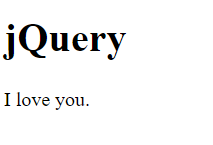
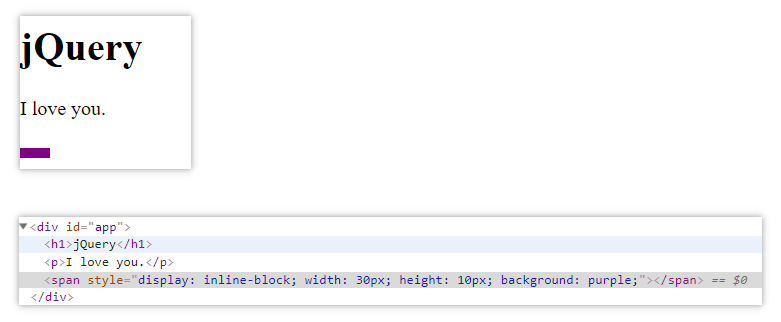
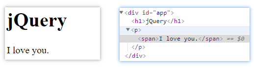
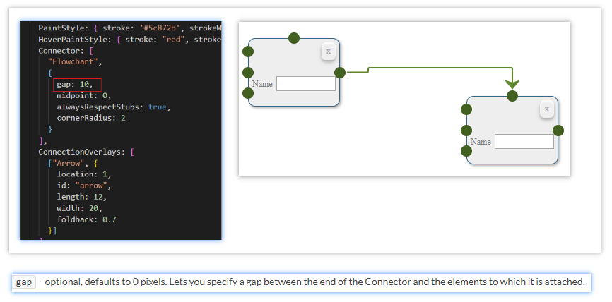
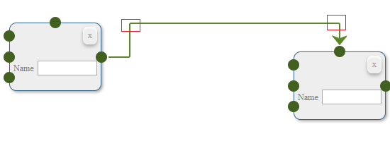
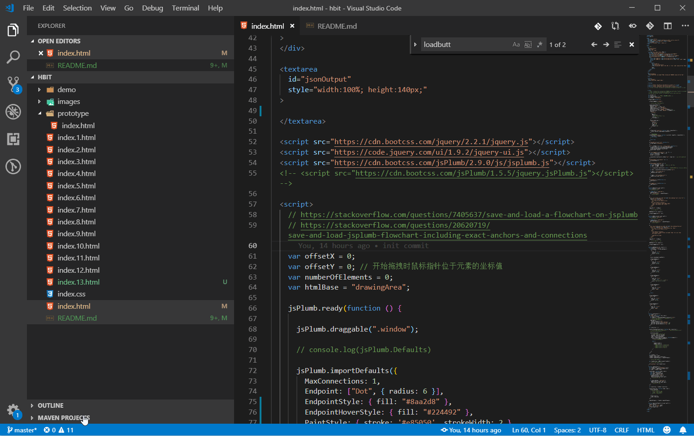

# jsPlumb Learning Notes

## Thanks

jsPlumb Learning Notes. Special Thanks To Stack Overflow user hbit.

## jQuery

### .appendTo

> Insert every element in the set of matched elements to the end of the target.

```html
<div id="app">
  <h1>jQuery</h1>
</div>

<script>
  $('<p>I love you.</p>').appendTo($('#app'))
</script>
```



#### 可以省略闭合标签

```html
<div id="app">
  <h1>jQuery</h1>
</div>

<script>
  $('<p>I love you.</p>').appendTo($('#app'))

  $('<span style="display: inline-block; width: 30px; height: 10px; background: purple;">').appendTo($('#app')) // span 未写 “闭合” 标签
</script>
```



Codepen: <https://codepen.io/MonguDykrai/pen/RdyGjL>

<http://api.jquery.com/appendto/>

### .html()

#### .html(htmlString)

> A string of HTML to set as the content of each matched element.

```html
<div id="app">
  <h1>jQuery</h1>
</div>

<script>
  $('<p>').appendTo($('#app')).html('<span>I love you.')
</script>
```



Codepen: <https://codepen.io/MonguDykrai/pen/MxGbwK>

<http://api.jquery.com/html/>

## save and load

Save

```js
$.each(jsPlumb.getConnections(), function (idx, connection) {
    connections.push({
    connectionId: connection.id,
    pageSourceId: connection.sourceId,
    pageTargetId: connection.targetId,
    anchors: $.map(connection.endpoints, function(endpoint) {

      return [[endpoint.anchor.x, 
      endpoint.anchor.y, 
      endpoint.anchor.orientation[0], 
      endpoint.anchor.orientation[1],
      endpoint.anchor.offsets[0],
      endpoint.anchor.offsets[1]]];

    })
  });
});
```

Load

```js
$.each(connections, function( index, elem ) {
    var connection1 = jsPlumb.connect({
    source: elem.pageSourceId,
    target: elem.pageTargetId,
    anchors: elem.anchors
  });

});
```

<https://stackoverflow.com/questions/20620719/save-and-load-jsplumb-flowchart-including-exact-anchors-and-connections>

## Connectors

### gap

> optional, defaults to 0 pixels. Lets you specify a gap between the end of the Connector and the elements to which it is attached.



### cornerRadius



<http://jsplumb.github.io/jsplumb/connectors.html>

## getUuid | getUuids

```js
jsPlumb.bind("connection", function (conn, originalEvent) {
  console.log(conn.targetEndpoint.getUuid());
});
```

```js
const endpoint = jsPlumb.addEndpoint(
  $("#" + id),
  {
    uuid: id + "lt-in",
    isTarget: true,
    anchor: [0, 0.2]
  }
);

console.log(endpoint.getUuid());
```

```js
$.each(jsPlumb.getConnections(), function (idx, connection) {
  // console.log(connection.getUuids()); // ["decisioncontainer1rm-out", "decisioncontainer2lm-in"]

  connections.push({
    // connectionId: connection.id,
    sourceId: connection.sourceId,
    targetId: connection.targetId,
    uuids: connection.getUuids(), // getUuids
    anchors: $.map(connection.endpoints, function(endpoint) {
      console.error(endpoint.getUuid());
      // console.log(endpoint)

      return [
        [
          endpoint.anchor.x, 
          endpoint.anchor.y, 
          // endpoint.anchor.orientation[0], 
          // endpoint.anchor.orientation[1],
          // endpoint.anchor.offsets[0],
          // endpoint.anchor.offsets[1]
        ]
      ];

    })
  });
});
```

### 使用 uuid 回显

```js
$.each(connections, function (index, elem) {
  console.log(elem)
  // jsPlumb.connect({
  //   source: elem.sourceId,
  //   target: elem.targetId,
  //   anchors: elem.anchors
  // });

  jsPlumb.connect({
    uuids: elem.uuids
  });
});
```

<https://community.jsplumbtoolkit.com/apidocs/classes/Endpoint.html#method_getUuid>

## 完整代码



```html
<!DOCTYPE html>
<html lang="en">

<head>
  <meta charset="UTF-8">
  <meta name="viewport" content="width=device-width, initial-scale=1.0">
  <meta http-equiv="X-UA-Compatible" content="ie=edge">
  <title>Document</title>
  <!-- <link rel="stylesheet" href="./index.css"> -->
  <style>
    .window {}

    .window:hover {
      cursor: pointer;
    }

    .menu {
      background-color: #EFEFEF;
      border: 1px solid #346789;
      box-shadow: 2px 2px 5px #AAAAAA;
      color: black;
      min-height: 3em;
      position: absolute;
      min-width: 5em;
    }

    .task {
      background-color: #EEEEEF;
      border: 1px solid #346789;
      border-radius: 0.5em;
      box-shadow: 2px 2px 5px #AAAAAA;
      color: black;
      min-height: 3em;
      position: absolute;
      min-width: 5em;
    }

    /* Start End */
    .point {
      background-color: #333333;
      border: 1px solid #AAAAAA;
      border-radius: 50%;
      box-shadow: 2px 2px 5px #AAAAAA;
      color: white;
      min-width: 50px;
      min-height: 30px;
      font-size: 11pt;
      padding: 10px;
      position: absolute;
      text-align: center;
    }

    .point:hover {
      box-shadow: 2px 2px 19px #AAAAAA;
    }

    .decision {
      /* transform: rotate(-45deg); */
      overflow: hidden;
      border: 1px solid #346789;
      border-radius: 0.3em;
      color: black;
      backface-visibility: hidden;
      background: none repeat scroll 0 0 #F4F4F4;
      box-shadow: 0 0 0 1px #CCCCCC;
      color: #000000;
      display: block;
      height: 80px;
      overflow: hidden;
      /* position: relative; */
      position: absolute;
      text-decoration: none;
      width: 80px;
    }

    .decision .ctrl-container {
      display: table-cell;
      height: 80px;
      padding: 0 10px;
      text-align: center;
      /* transform: rotate(45deg); */
      vertical-align: middle;
      width: 80px;
    }

    .button {
      text-align: center;
      border: 1px solid;
      margin: 5px;
    }

    .button:hover {
      cursor: pointer;
    }

    .menu-button {
      padding: 5px;
    }

    .menu-button:hover {
      background-color: #AAAAAA;
      color: black;
    }

    .button_add {
      background-color: #00CC00;
      float: left;
      border-radius: 50%;
      box-shadow: 0px 3px 8px #aaa, inset 0px 2px 3px #fff;
      padding: 2px;
      height: 25px;
      width: 25px;
      color: grey;
    }

    .button_add:hover {
      background-color: #00AA00;
      color: black;
    }

    .button-remove {
      font-size: 9pt;
      color: darkgrey;
      border-radius: 30%;
      box-shadow: 0px 3px 8px #aaa, inset 0px 2px 3px #fff;
      padding: 5px;
      min-width: 10px;
      max-width: 15px;
      text-align: center;
    }

    .task .button-remove {
      float: right;
    }

    .decision .button-remove {
      margin: auto auto;
    }

    .button-remove:hover {
      background-color: darkred;
      color: white;
    }

    .menu-button-container {
      margin: 5px;
    }

    .ctrl-container {
      margin: 5px;
      height: 40px;
    }

    .details-container {
      margin: 5px;
      min-height: 40px;
    }

    .detail-label {
      font-size: 9pt;
      color: grey;
    }

    .detail-text {
      width: 80px;
      font-size: 10pt;
    }

    ._jsPlumb_connector,
    ._jsPlumb_startpoint {
      cursor: pointer;
    }
  </style>
</head>

<body>
  <!-- Menu -->
  <div
    id="menuContainer"
    class="menu"
    style="left: 20px;"
  >
    <p style="text-align: center;">Menu</p>
    <div class="menu-button-container">
      <div class="button-add-task button menu-button ele-draggable" id="button-add-task" draggable="true">Add Task</div>
      <div class="button-add-decision button menu-button ele-draggable" id="button-add-decision" draggable="true">Add Decision</div>
      <div>
        <button id="saveButton" class="button menu-button">Save</button>
        <button id="loadButton" class="button menu-button" style="float: right;">Load</button>
      </div>
      <div>
          <button
            id="resetButton"
            class="button menu-button"
            style="background: rgba(0, 169, 200, 1); float: right; margin-bottom: 10px;"
          >
            Reset
          </button>
      </div>
    </div>
  </div>

  <div 
    id="canvas"
    style="width:100%; min-height:700px; background: #d6d6d6; margin-bottom: 6px;"
  >
  </div>

  <textarea
    id="jsonOutput"
    style="width:100%; height:140px;"
  >
    {"nodes":[{"blockId":"decisioncontainer7","nodetype":"decision","positionX":339,"positionY":158},{"blockId":"taskcontainer8","nodetype":"task","positionX":436,"positionY":313},{"blockId":"decisioncontainer9","nodetype":"decision","positionX":679,"positionY":369},{"blockId":"taskcontainer10","nodetype":"task","positionX":926,"positionY":374},{"blockId":"decisioncontainer7","nodetype":"decision","positionX":339,"positionY":158},{"blockId":"decisioncontainer7","nodetype":"decision","positionX":339,"positionY":158},{"blockId":"taskcontainer11","nodetype":"task","positionX":621,"positionY":132},{"blockId":"decisioncontainer12","nodetype":"decision","positionX":1280,"positionY":376}],"connections":[{"sourceId":"decisioncontainer7","targetId":"taskcontainer8","uuids":["decisioncontainer7rm-out","taskcontainer8tm-in"],"anchors":[[1,0.5],[0.5,0]]},{"sourceId":"taskcontainer8","targetId":"decisioncontainer9","uuids":["taskcontainer8rm-out","decisioncontainer9lm-in"],"anchors":[[1,0.5],[0,0.5]]},{"sourceId":"decisioncontainer9","targetId":"taskcontainer10","uuids":["decisioncontainer9rm-out","taskcontainer10lb-in"],"anchors":[[1,0.5],[0,0.8]]},{"sourceId":"taskcontainer11","targetId":"taskcontainer10","uuids":["taskcontainer11rm-out","taskcontainer10lt-in"],"anchors":[[1,0.5],[0,0.2]]},{"sourceId":"taskcontainer10","targetId":"decisioncontainer12","uuids":["taskcontainer10rm-out","decisioncontainer12lm-in"],"anchors":[[1,0.5],[0,0.5]]}],"numberOfElements":12}
  </textarea>

  <script src="https://cdn.bootcss.com/jquery/2.2.1/jquery.js"></script>
  <script src="https://cdn.bootcss.com/jsPlumb/2.9.0/js/jsplumb.js"></script>

  <script>
    var offsetX = 0;
    var offsetY = 0; // 开始拖拽时鼠标指针位于元素的坐标值
    var numberOfElements = 0;
    var htmlBase = "canvas";

    jsPlumb.ready(function () {

      jsPlumb.draggable(".window");

      // console.log(jsPlumb.Defaults)

      jsPlumb.importDefaults({
        MaxConnections: 1,
        Endpoint: ["Dot", { radius: 6 }],
        EndpointStyle: { fill: "#8aa2d8" },
        EndpointHoverStyle: { fill: "#224492" },
        PaintStyle: { stroke: '#e85050', strokeWidth: 2 },
        HoverPaintStyle: { stroke: "#9e1b1b", strokeWidth: 2 },
        Connector: [
          "Flowchart",
          {
            gap: 10,
            midpoint: 0,
            // alwaysRespectStubs: true,
            stub: 2,
            cornerRadius: 2
          }
        ],
        ConnectionOverlays: [
          ["Arrow", {
            location: 1,
            id: "arrow",
            length: 10,
            width: 14,
            foldback: 0.6
          }]
        ]
      });

      // jsPlumb.bind("connection", function (conn, originalEvent) {
      //   console.log(conn.targetEndpoint.getUuid());
      // });

      // 不能自己连自己
      jsPlumb.bind("beforeDrop", function ({ sourceId, targetId }, originalEvent) {
        if (sourceId == targetId) {
          return false;
        }

        return true;
      });

      $("#resetButton").on("click", function () {
        jsPlumb.empty("canvas");
      });

      $("#" + htmlBase).on("click", ".button-remove", function () {
        var parentnode = $(this)[0].parentNode.parentNode;
        jsPlumb.deleteConnectionsForElement(parentnode);
        jsPlumb.removeAllEndpoints(parentnode);
        $(parentnode).remove();
      });

      $(".ele-draggable").on("dragstart", (ev, ff) => {
        const { originalEvent, target } = ev;
        offsetX = ev.offsetX;
        offsetY = ev.offsetY;

        originalEvent.dataTransfer.setData("text", target.id); // e.g. button-add-task
      });

      $("#canvas").on("dragover", ev => {
        ev.preventDefault();
      });

      $("#canvas").on("drop", ev => {
        const { originalEvent } = ev;
        var posX = ev.pageX - offsetX; // 需要减去鼠标的偏移值
        var posY = ev.pageY - offsetY;

        if (!originalEvent.dataTransfer) return; // 连线时会触发 drop 事件，值为 undfined

        var data = originalEvent.dataTransfer.getData("text");

        if (data == "button-add-task") {
          addTask({ posX, posY });
        }

        if (data == "button-add-decision") {
          addDecision({ posX, posY });
        }
      });

      $("#saveButton").click(function () {
        saveFlowchart();
      });

      $("#loadButton").click(function () {
        loadFlowchart();
      });
    });

    function addTask({id, posX, posY}) {
      const scenario = "task";
      // console.warn(id);

      if (typeof id === "undefined") {
        numberOfElements++;
        id = "taskcontainer" + numberOfElements;
        // console.log(id);
      }

      $(`
        <div class="window task node" id="${id}" data-nodetype="task" style="left: ${posX}px; top: ${posY}px;">
          <div class="ctrl-container">
            <div class="button-remove">x</div>
          </div>
          <div class="details-container">
            <label class="detail-label">Name</label>
            <input class="detail-text" />
          </div>
        </div>
      `)
      .appendTo("#" + htmlBase);

      // console.log(id)

      addEndpoint({ id, scenario })

      jsPlumb.draggable(id);
    }

    function addDecision({id, posX, posY}) {
      const scenario = "decision";
      // console.warn(id);

      if (typeof id === "undefined") {
        numberOfElements++;
        id = "decisioncontainer" + numberOfElements;
        // console.log(id);
      }

      $(`
        <div class="window decision node" id="${id}" data-nodetype="decision" style="left: ${posX}px; top: ${posY}px;">
          <div class="ctrl-container" style="margin-top: -10px;">
            <div class="button-remove">x</div>
          </div>
          <div
            class="details-container"
            style="margin: -20px 0 0 6px; min-height: 20px; font-size: 12px; text-align: center;"
          >
            <span>Decision</span>
          </div>
        </div>
      `)
      .appendTo("#" + htmlBase);

      // console.log(id)

      addEndpoint({ id, scenario })

      jsPlumb.draggable(id);
    }

    function addEndpoint({ id, scenario }) {
      if (scenario == "task") {
        const endpoint = jsPlumb.addEndpoint(
          id,
          {
            uuid: id + "lt-in",
            isTarget: true,
            anchor: [0, 0.2]
          }
        );

        console.log(endpoint.getUuid());

        jsPlumb.addEndpoint(
          id,
          {
            uuid: id + "lm-in",
            isTarget: true,
            anchor: [0, 0.5]
          }
        );

        jsPlumb.addEndpoint(
          id,
          {
            uuid: id + "lb-in",
            isTarget: true,
            anchor: [0, 0.8]
          }
        );

        jsPlumb.addEndpoint(
          id,
          {
            uuid: id + "tm-in",
            isTarget: true,
            // anchor: [0.5, 0, 0, -1, 100, 0],
            anchor: [0.5, 0, 0, -1, 0, 0],
          }
        );

        jsPlumb.addEndpoint(
          id,
          {
            uuid: id + "rm-out",
            isSource: true,
            anchor: "Right"
          }
        );

        return;
      }

      jsPlumb.addEndpoint(
        id,
        {
          uuid: id + "lm-in",
          isTarget: true,
          anchor: [0, 0.5]
        }
      );

      jsPlumb.addEndpoint(
        id,
        {
          uuid: id + "rm-out",
          isSource: true,
          anchor: "Right"
        }
      );

    }

    function saveFlowchart() {
      var nodes = []
      $(".node").each(function (idx, elem) {
        var $elem = $(elem);
        nodes.push({
          blockId: $elem.attr("id"),
          nodetype: $elem.attr("data-nodetype"),
          positionX: parseInt($elem.css("left"), 10),
          positionY: parseInt($elem.css("top"), 10)
        });
      });

      var connections = [];

      $.each(jsPlumb.getConnections(), function (idx, connection) {
        // console.log(connection.getUuids()); // ["decisioncontainer1rm-out", "decisioncontainer2lm-in"]

        connections.push({
          // connectionId: connection.id,
          sourceId: connection.sourceId,
          targetId: connection.targetId,
          uuids: connection.getUuids(),
          anchors: $.map(connection.endpoints, function(endpoint) {
            console.error(endpoint.getUuid());
            // console.log(endpoint)

            return [
              [
                endpoint.anchor.x, 
                endpoint.anchor.y, 
                // endpoint.anchor.orientation[0], 
                // endpoint.anchor.orientation[1],
                // endpoint.anchor.offsets[0],
                // endpoint.anchor.offsets[1]
              ]
            ];

          })
        });
      });

      var flowChart = {};
      flowChart.nodes = nodes;
      flowChart.connections = connections;
      flowChart.numberOfElements = numberOfElements;

      // console.log(flowChart);

      var flowChartJson = JSON.stringify(flowChart);
      // console.log(flowChartJson);

      $("#jsonOutput").val(flowChartJson);
    }

    function loadFlowchart() {
      var flowChartJson = $("#jsonOutput").val();
      var flowChart = JSON.parse(flowChartJson);
      var nodes = flowChart.nodes;

      $.each(nodes, function (index, elem) {
        const id = elem.blockId;
        const posX = elem.positionX;
        const posY = elem.positionY;
        if (elem.nodetype == "task") {
          addTask({ id, posX, posY });
          repositionElement(id, posX, posY);
          // console.error(id);
        }

        if (elem.nodetype == "decision") {
          addDecision({ id, posX, posY });
          repositionElement(id, posX, posY);
          // console.error(id);
        }
      });

      var connections = flowChart.connections;

      $.each(connections, function (index, elem) {
        console.log(elem)
        // jsPlumb.connect({
        //   source: elem.sourceId,
        //   target: elem.targetId,
        //   anchors: elem.anchors
        // });

        jsPlumb.connect({
          uuids: elem.uuids
        })
      });

      numberOfElements = flowChart.numberOfElements;
    }

    function repositionElement({ id, posX, posY }) {
      console.log(id);
      $("#" + id).css("left", posX);
      $("#" + id).css("top", posY);
      jsPlumb.repaint(id);
    }
  </script>
</body>

</html>
```

## 注释最全的版本

> index.17.html

References:

<http://jsfiddle.net/t3nbL/1/>

<https://stackoverflow.com/questions/20620719/save-and-load-jsplumb-flowchart-including-exact-anchors-and-connections>